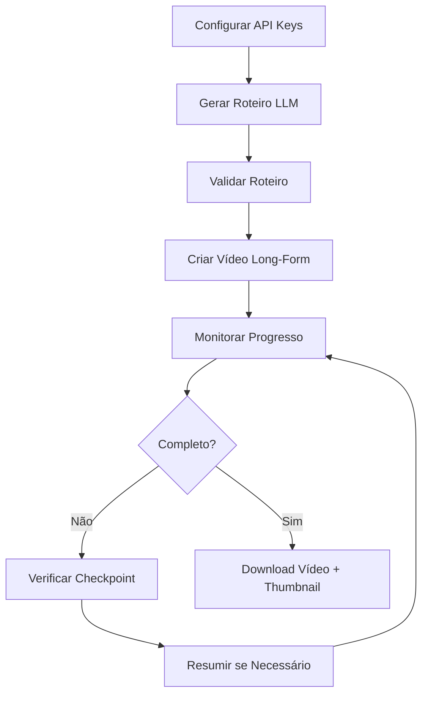

# MoneyPrinterTurbo - Extensão Long-Form Video

> Atualização de 07/09/2026: o estúdio web já foi integrado ao Streamlit.
> Consulte [o guia atual do estúdio](docs/STUDIO.md) para iniciar, configurar,
> produzir e retomar vídeos. O conteúdo abaixo descreve a implementação anterior;
> portas, exemplos de polling e declarações de conclusão não são validações atuais.

## 🚀 Quick Start

### 1. Iniciar Servidor
```bash
cd finback
uv run python main.py
# Servidor em: http://127.0.0.1:8081
# Docs: http://127.0.0.1:8081/docs
```

### 2. Configurar API Keys
```bash
curl -X POST http://127.0.0.1:8081/api/v1/llm-config \
  -H "Content-Type: application/json" \
  -d '{
    "configs": [{
      "provider": "openai",
      "api_key": "sk-YOUR-KEY",
      "model": "gpt-4o",
      "enabled": true
    }]
  }'
```

### 3. Gerar Roteiro
```bash
curl -X POST http://127.0.0.1:8081/api/v1/generate-script \
  -H "Content-Type: application/json" \
  -d '{
    "topic": "História da Inteligência Artificial",
    "duration_minutes": 20,
    "language": "pt-BR",
    "llm_provider": "openai"
  }' | jq . > script.json
```

### 4. Criar Vídeo
```bash
curl -X POST http://127.0.0.1:8081/api/v1/longform-videos \
  -H "Content-Type: application/json" \
  -d @video_request.json
```

## 📦 O Que Foi Implementado

### ✅ Funcionalidades Novas
1. **Geração Automática de Roteiro com LLM**
   - 6 providers: OpenAI, Claude, Gemini, DeepSeek, Kimi, Qwen
   - Personalização total (idioma, estilo, duração)
   - Validação automática

2. **Vídeos Long-Form (15-30 min)**
   - Pipeline completo de produção
   - 5-100 cenas por vídeo
   - Checkpoints para resumo

3. **Geração de Imagens por IA**
   - DALL-E 3, Stable Diffusion, Midjourney
   - Batch processing com rate limiting
   - Retry automático

4. **TTS Premium**
   - ElevenLabs, Play.ht, Murf.ai
   - Qualidade superior ao Edge TTS

5. **Thumbnails para YouTube**
   - IA + text overlay
   - 1280x720, otimizado <2MB

6. **Gerenciamento de API Keys**
   - Salvar/carregar via API
   - Persistência em config.toml
   - Mascaramento de segurança

### 📁 Arquivos Novos
```
app/services/
├── script_generator.py      (450 linhas)
├── image_generation.py      (300 linhas)
├── thumbnail.py             (250 linhas)
├── checkpoint.py            (200 linhas)
└── script_parser.py         (170 linhas)

app/controllers/v1/video.py  (+254 linhas)
app/models/schema.py         (+60 linhas)
app/services/task.py         (+437 linhas)
app/services/video.py        (+294 linhas)
app/services/voice.py        (+87 linhas)

test/test_longform.py        (350 linhas)
config.example.toml          (+95 linhas)
pyproject.toml               (+1 dep: anthropic)

Total: ~2,470 linhas de código novo
```

## 🔌 Endpoints Principais

| Endpoint | Método | Descrição |
|----------|--------|-----------|
| `/api/v1/generate-script` | POST | Gerar roteiro com LLM |
| `/api/v1/validate-script` | POST | Validar roteiro JSON |
| `/api/v1/llm-config` | POST | Salvar API keys |
| `/api/v1/llm-config` | GET | Ver configurações |
| `/api/v1/longform-videos` | POST | Criar vídeo 15-30min |
| `/api/v1/checkpoint-status/{id}` | GET | Ver progresso |
| `/api/v1/resume-task/{id}` | POST | Resumir tarefa |

## ⚙️ Configuração Rápida (config.toml)

```toml
listen_port = 8081

[llm.openai]
api_key = "sk-YOUR-KEY"
model = "gpt-4o"
enabled = true

[llm.claude]
api_key = "sk-ant-YOUR-KEY"
model = "claude-3-5-sonnet-20241022"
enabled = true

[image_generation]
default_provider = "dalle"
dalle_quality = "standard"

[premium_tts]
elevenlabs_api_key = ""
elevenlabs_voice_id = ""

[longform]
max_video_duration = 1800
enable_checkpoint = true
```

## 💰 Custos Estimados

| Item | Custo (20min) |
|------|---------------|
| DALL-E 3 (48 imgs) | $1.92 |
| ElevenLabs TTS | $0.05 |
| GPT-4o Roteiro | $0.12 |
| **Total** | **~$2.09** |

## ⏱️ Tempo de Processamento

- Script: 5-15s
- Áudio: 2-5 min
- Imagens: 10-20 min
- Vídeo: 15-25 min
- **Total: 30-50 min**

## 📊 Fluxo de Trabalho



## 🎨 Providers Suportados

### LLM (Geração de Roteiro)
- ✅ OpenAI (GPT-4o, GPT-4o-mini)
- ✅ Claude (3.5 Sonnet, Opus, Haiku)
- ✅ Gemini (2.0 Flash, 1.5 Pro)
- ✅ DeepSeek
- ✅ Kimi (Moonshot 128k)
- ✅ Qwen (Alibaba)

### Imagens
- ✅ DALL-E 3 (OpenAI)
- ✅ Stable Diffusion (Replicate)
- ✅ Midjourney (via wrapper)

### TTS
- ✅ ElevenLabs (premium)
- ✅ Play.ht (premium)
- ✅ Murf.ai (premium)
- ✅ Edge TTS (grátis)
- ✅ Azure TTS (padrão)

## 🔒 Segurança

- ✅ API keys mascaradas em GET
- ✅ Validação Pydantic
- ✅ Rate limiting interno
- ✅ Sanitização de inputs
- ✅ Checkpoints seguros

## 🐛 Troubleshooting

### Erro: "LLM provider not configured"
```bash
# Configurar API key
curl -X POST http://localhost:8081/api/v1/llm-config -d '...'
```

### Erro: "at least 5 scenes"
```json
// Adicionar mais cenas ao script
{"scenes": [...]} // mínimo 5 cenas
```

### Tarefa Travada
```bash
# Verificar status
curl http://localhost:8081/api/v1/checkpoint-status/{task_id}

# Resumir
curl -X POST http://localhost:8081/api/v1/resume-task/{task_id}
```

## 📚 Documentação Completa

- **Docs Detalhadas:** `LONGFORM_VIDEO_DOCUMENTATION.md`
- **API Interativa:** http://127.0.0.1:8081/docs
- **GitHub Original:** https://github.com/harry0703/MoneyPrinterTurbo

## 🎯 Exemplo Completo Python

```python
import requests
import json
import time

API = "http://localhost:8081/api/v1"

# 1. Config
requests.post(f"{API}/llm-config", json={
    "configs": [{
        "provider": "openai",
        "api_key": "sk-YOUR-KEY",
        "model": "gpt-4o",
        "enabled": True
    }]
})

# 2. Gerar roteiro
script_resp = requests.post(f"{API}/generate-script", json={
    "topic": "História da IA",
    "duration_minutes": 20,
    "language": "pt-BR",
    "llm_provider": "openai"
})
script = script_resp.json()['data']['script']

# 3. Criar vídeo
video_resp = requests.post(f"{API}/longform-videos", json={
    "structured_script": script,
    "use_structured_script": True,
    "image_provider": "dalle",
    "premium_tts_provider": "elevenlabs"
})
task_id = video_resp.json()['data']['task_id']

# 4. Monitorar — ausência de checkpoint ou HTTP 404 NUNCA significa sucesso;
#    acompanhe o status real da produção até ela terminar
while True:
    status = requests.get(f"{API}/checkpoint-status/{task_id}")
    if status.status_code == 404:
        print("Produção não encontrada.")
        break
    data = status.json()['data']
    print(f"Status: {data['status']} | Fase: {data['current_phase']} | Progresso: {data['progress']}%")
    if data['status'] == 'completed':
        print("Vídeo completo!")
        break
    if data['status'] in ('failed', 'interrupted'):
        print(f"Produção {data['status']}: {data['error']}")
        break
    time.sleep(30)
```

## 🚀 Status do Projeto

- ✅ **Backend Completo** - Todos os endpoints funcionando
- ✅ **Testes Unitários** - Cobertura básica implementada
- ✅ **Documentação** - Completa e detalhada
- ✅ **Servidor Rodando** - http://127.0.0.1:8081
- ⏳ **Frontend Web** - Próxima etapa (Streamlit)

---

**Última Atualização:** 2026-09-07
**Versão:** 1.3.0 Extended
